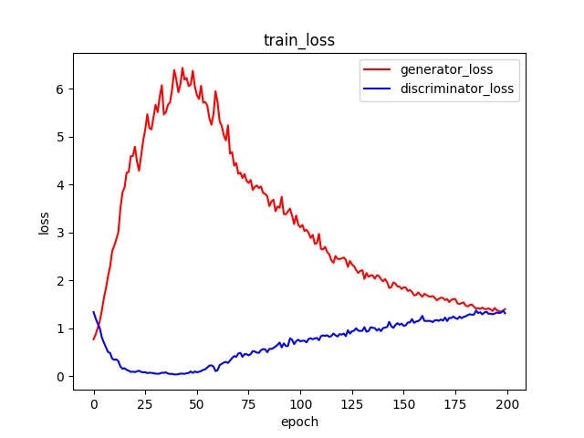
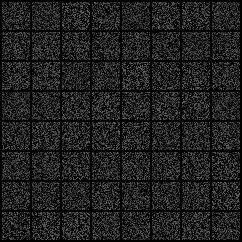
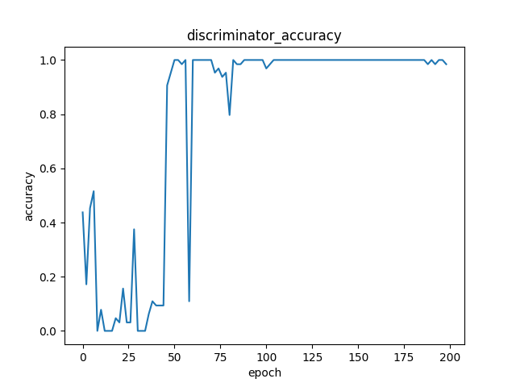
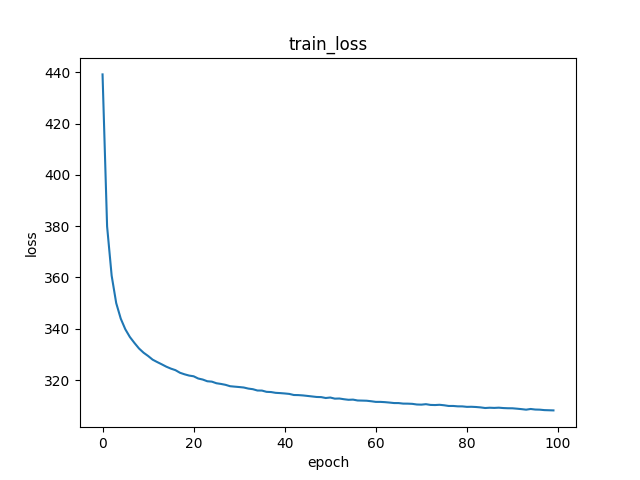
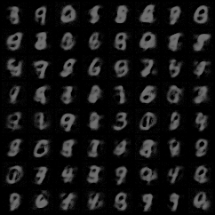
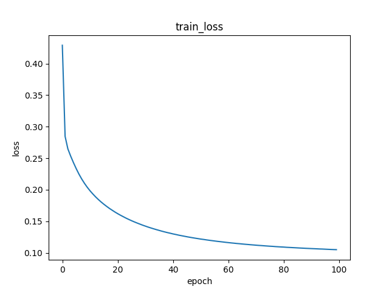
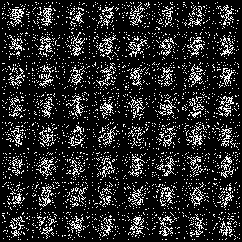

# DGMHowTo
A collection of vanilla **Deep Generative Models** (**DGM**) re-implementation with clean and well-annotated PyTorch implementation for systematic learning toward Deep Generative Models.

## Support Models
* **[Generative Adversarial Networks](https://arxiv.org/abs/1406.2661)** (**GAN**)
* **[Variational Auto-Encoder](https://arxiv.org/abs/1312.6114)** (**VAE**)
* **[Neural Autoregressive Distribution Estimation](https://arxiv.org/abs/1605.02226)** (**NADE**)

## Get Started
```bash
# install dependencies
pip install -r requirements.txt

# prepare your dataset in `data`

# prepare your experiment configuration in `configs`

# train the model
python train_*.py --config configs/*.txt
```

## Results
### GAN
* loss process graph



* noise generation process



* noise discriminator accuracy process



### VAE
* loss process graph



* noise generation process



### NADE
* loss process graph



* random generation process



## Note
Kudos to the authors for their amazing results.
```bib
@article{Kingma2014AutoEncodingVB,
  title={Auto-Encoding Variational Bayes},
  author={Diederik P. Kingma and Max Welling},
  journal={CoRR},
  year={2014},
  volume={abs/1312.6114}
}
```
```bib
@article{goodfellow2020generative,
  title={Generative adversarial networks},
  author={Goodfellow, Ian and Pouget-Abadie, Jean and Mirza, Mehdi and Xu, Bing and Warde-Farley, David and Ozair, Sherjil and Courville, Aaron and Bengio, Yoshua},
  journal={Communications of the ACM},
  volume={63},
  number={11},
  pages={139--144},
  year={2020},
  publisher={ACM New York, NY, USA}
}
```
```bib
@inproceedings{larochelle2011neural,
  title={The neural autoregressive distribution estimator},
  author={Larochelle, Hugo and Murray, Iain},
  booktitle={Proceedings of the fourteenth international conference on artificial intelligence and statistics},
  pages={29--37},
  year={2011},
  organization={JMLR Workshop and Conference Proceedings}
}
```
